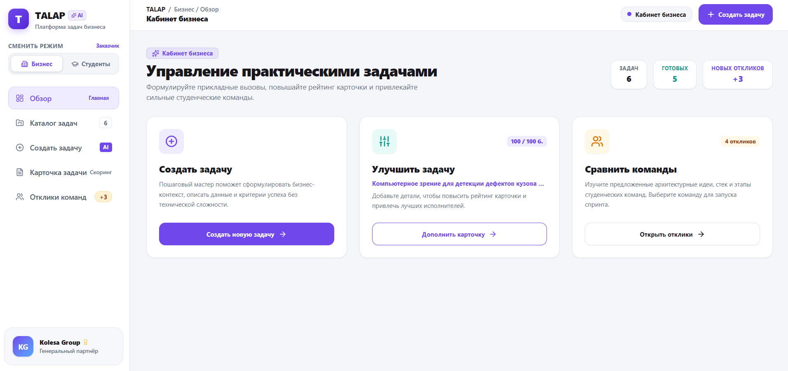
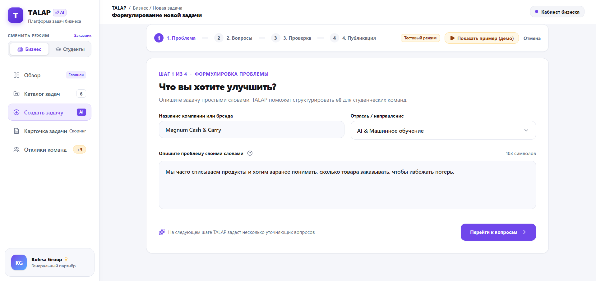
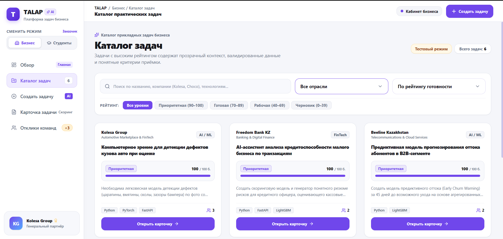
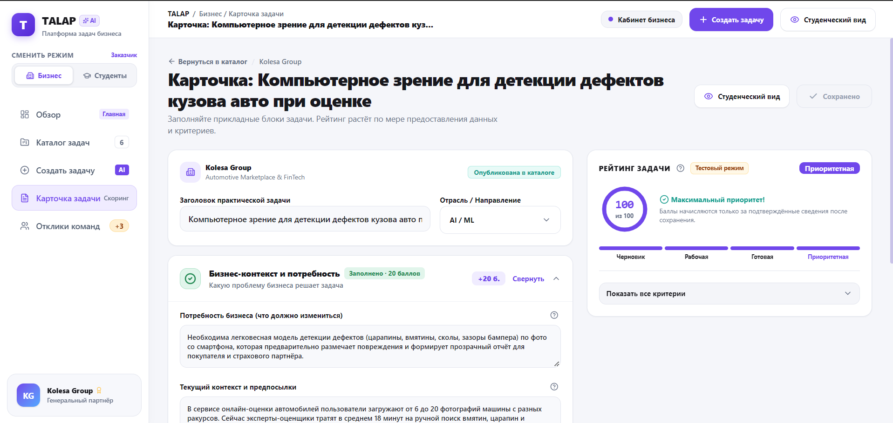
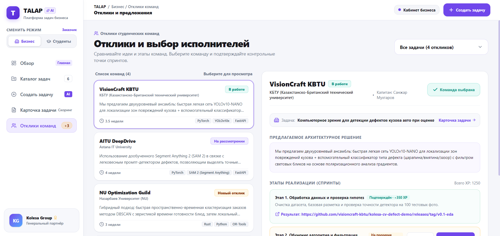
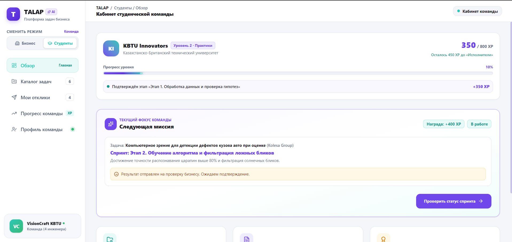
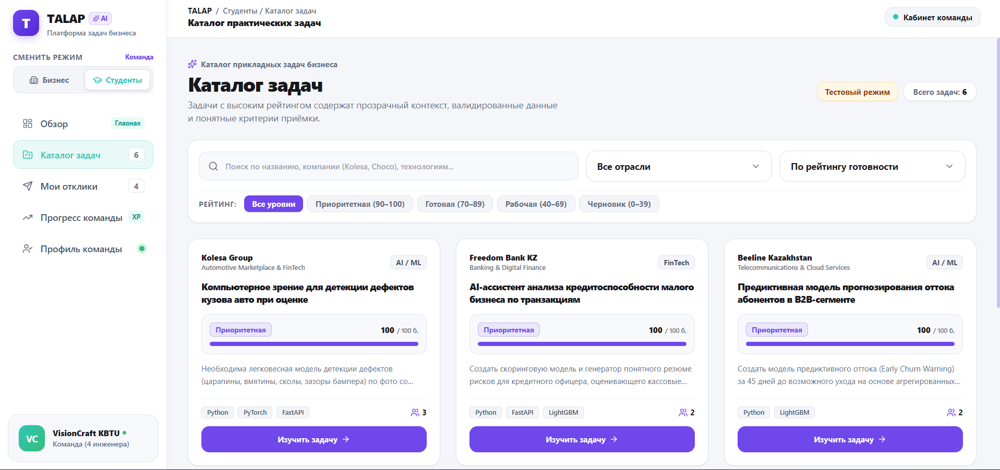
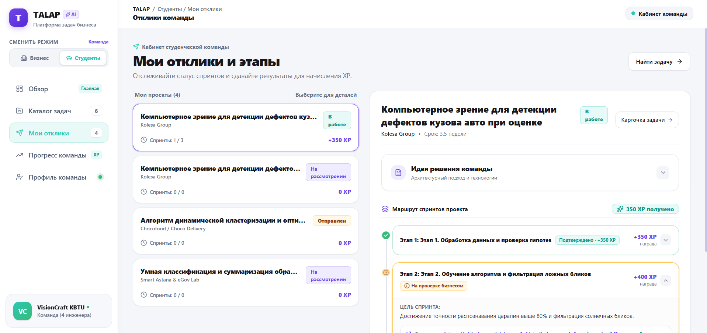
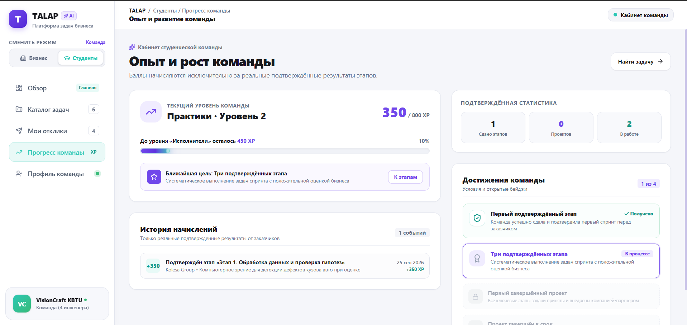
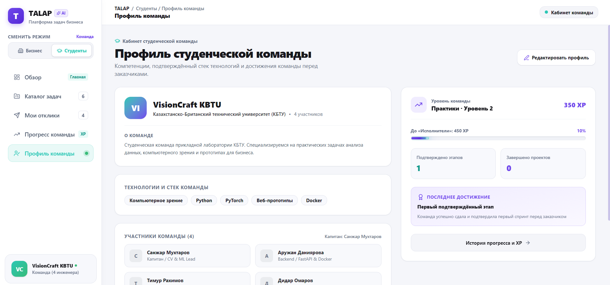

# Run and deploy your AI Studio app

This contains everything you need to run your app locally.

View your app in AI Studio: https://ai.studio/apps/35834c65-075e-4301-9a70-d10a0a7d685b

## UI/UX и интерфейс

Интерфейс TALAP разделен на два режима:

- бизнес создает задачи, улучшает карточки и выбирает команды;
- студенты находят задачи, отправляют предложения, выполняют этапы и получают подтвержденный XP.

### Обзор бизнеса

Главный экран объединяет создание задачи, улучшение существующей карточки и просмотр откликов команд.

### Создание задачи

Пошаговая форма помогает описать проблему, ответить на уточняющие AI-вопросы, проверить карточку и опубликовать задачу.

### Каталог задач бизнеса

Каталог содержит поиск, фильтры, рейтинг готовности и быстрый переход к редактированию задачи.

### Карточка и рейтинг задачи

Карточка объединяет бизнес-контекст, данные, ограничения, ожидаемый результат и серверный рейтинг готовности.

### Отклики и выбор команды

Бизнес сравнивает идеи, технологии и этапы команд, после чего выбирает исполнителя.

### Обзор студенческой команды

Обзор показывает уровень команды, XP, ближайшую миссию и следующее доступное действие.

### Каталог задач

Студенты используют поиск и фильтры, изучают требования и выбирают подходящие практические задачи.

### Мои отклики и этапы

Экран объединяет проекты команды и визуальный маршрут спринтов со статусами и наградами.

### Прогресс команды

Команда видит текущий этап, выполненные шаги, подтверждения бизнеса и начисленный XP.

### Профиль команды

Профиль показывает состав команды, уровень, специализации и накопленный опыт.

## Run Locally

**Prerequisites:**  Node.js

1. Install dependencies:
   `npm install`
2. Set the `GEMINI_API_KEY` in [.env.local](.env.local) to your Gemini API key
3. Run the app:
   `npm run dev`
