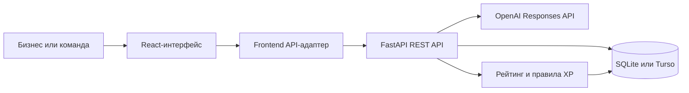

# TALAP - платформа бизнес-задач для студенческих команд

TALAP (рабочее название репозитория - **Burkit / AI Sana**) - веб-платформа, которая помогает компаниям формулировать прикладные задачи, а студенческим командам - находить такие задачи, предлагать решения и сдавать результаты по этапам.

Проект решает две связанные проблемы:

- бизнесу сложно превратить общую проблему в понятную карточку с данными, ограничениями и измеримыми критериями успеха;
- студенческим командам не хватает единого каталога реальных задач и прозрачного процесса от отклика до подтверждённого результата.

AI-модуль задаёт уточняющие вопросы к черновику, а backend рассчитывает готовность карточки. После публикации команды могут отправлять отклики, бизнес - выбирать исполнителя и подтверждать этапы работы.

## Что реализовано

### Для бизнеса

- мастер создания задачи с пошаговым заполнением карточки;
- генерация 3-5 структурированных уточняющих вопросов в режимах `mock` и `openai`;
- серверная оценка полноты карточки от 0 до 100;
- уровни готовности: `Черновик`, `Рабочая`, `Готовая`, `Приоритетная`;
- сохранение черновика, редактирование, публикация и отдельное закрытие задачи;
- просмотр откликов и однократный выбор либо отклонение команды;
- серверные этапы выбранного отклика: создание, отправка результата, запрос доработки и подтверждение;
- атомарное начисление XP с защитой от повторного и одновременного подтверждения.

### Для студенческой команды

- каталог опубликованных бизнес-задач;
- карточка задачи с ожидаемым результатом, данными и критериями успеха;
- отправка отклика с идеей, планом, сроком и ссылкой на прототип;
- интерфейсы этапов, прогресса, истории XP и профиля команды;
- backend API для сохранения ссылки на результат этапа.

### Backend и качество

- REST API с OpenAPI-схемой и Swagger UI;
- единые структурированные ошибки валидации;
- SQLite для локальной разработки и Turso/libSQL для Vercel;
- начальные данные: 10 задач, 5 команд и 5 откликов;
- тесты API-контракта, AI-ответов, сидирования, облачного адаптера, переходов статусов и конкурентного начисления XP.

## Как работает решение

Основной сценарий:

1. Представитель бизнеса вводит исходное описание проблемы.
2. FastAPI сохраняет черновик и запрашивает уточняющие вопросы у OpenAI либо возвращает детерминированные mock-вопросы.
3. Ответы записываются в поля карточки: пользователи, данные, ограничения, ожидаемый результат и критерии успеха.
4. Backend пересчитывает рейтинг готовности. Клиент получает готовое значение и список недостающих полей.
5. После заполнения названия бизнес публикует задачу в каталоге.
6. Студенческая команда отправляет отклик с идеей, планом, сроком и ссылкой на прототип.
7. Бизнес выбирает отклик. Только после этого к нему можно привязать этапы выполнения.
8. Backend принимает ссылку на результат этапа и позволяет подтвердить результат или вернуть его на доработку; полная связка этих действий с frontend пока не завершена.
9. При подтверждении backend в одной транзакции меняет статус этапа и начисляет XP. Повторный запрос не увеличивает баланс.
10. Закрытие бизнес-задачи выполняется отдельным действием и не происходит автоматически после подтверждения этапа.

## Технологии

| Область | Используется в проекте |
| --- | --- |
| Frontend | TypeScript, React 19, Vite 8 |
| UI | Tailwind CSS 4, Motion, Lucide React |
| Backend | Python, FastAPI, Pydantic, Uvicorn |
| AI | OpenAI Python SDK, Responses API, Structured Outputs по JSON Schema; модель задаётся через `OPENAI_MODEL`, значение по умолчанию - `gpt-5-mini` |
| Данные | SQLite локально, Turso/libSQL в облачном окружении |
| Деплой | Vercel: статическая Vite-сборка и Python Function `api/index.py` |
| Тестирование | `unittest`, FastAPI `TestClient` |

Пакет `@google/genai` присутствует в зависимостях frontend, но backend AI-вопросов поддерживает режимы `mock` и OpenAI Responses API.

## Архитектура проекта



Основные компоненты:

- `src/` - React-интерфейс, экраны двух ролей и клиентские адаптеры данных;
- `src/services/api.ts` - запросы к реальному FastAPI для задач и откликов;
- `src/api/talapApi.ts` - адаптер экранов к реальному FastAPI-клиенту;
- `backend/main.py` - маршруты API и переходы статусов;
- `backend/schemas.py` - входные и выходные Pydantic-модели;
- `backend/schema.sql` - таблицы задач, команд, откликов, этапов и начислений;
- `backend/services/ai_service.py` - mock/OpenAI-генерация вопросов и проверка структуры ответа;
- `backend/services/rating.py` и `rating.py` - единая формула рейтинга;
- `api/index.py` - точка входа FastAPI для Vercel Functions;
- `tests/` - автоматические backend-тесты.

Подробный контракт доступен после запуска backend в Swagger по адресу `/docs`.

## Установка и запуск

Понадобятся Git, Node.js с npm и Python 3.10 или новее.

### 1. Получить проект

```powershell
git clone https://github.com/BAITC-Hacks/hack-f11703d9-burkit-team.git
cd hack-f11703d9-burkit-team
```

### 2. Запустить backend

```powershell
py -m venv .venv
.venv\Scripts\Activate.ps1
pip install -r backend/requirements.txt
$env:AI_MODE = "mock"
uvicorn backend.main:app --reload
```

После запуска API будет доступен по адресу `http://127.0.0.1:8000`, Swagger - `http://127.0.0.1:8000/docs`.

Локальная SQLite-база создаётся автоматически при первом обращении к приложению.

### 3. Запустить frontend

В отдельном терминале:

```powershell
npm install
$env:VITE_API_URL = "http://127.0.0.1:8000/api"
npm run dev
```

Frontend по умолчанию запускается на `http://localhost:3000`.

### 4. Включить реальный OpenAI-режим

Для локальной проверки:

```powershell
$env:AI_MODE = "openai"
$env:OPENAI_API_KEY = "sk-..."
$env:OPENAI_MODEL = "gpt-5-mini"
$env:OPENAI_TIMEOUT_SECONDS = "20"
uvicorn backend.main:app --reload
```

Для production ключ должен быть задан только в Vercel Environment Variables. Его нельзя добавлять в frontend-переменные, Git, ответы API или логи.

## Как проверить решение

### Быстрая проверка через интерфейс

1. Запустить backend и frontend.
2. Открыть `http://localhost:3000`.
3. Перейти в роль бизнеса.
4. Создать или открыть задачу и заполнить поля карточки.
5. Проверить, что карточка получает рейтинг готовности и список недостающих данных.
6. Перейти в каталог задач от лица команды.
7. Открыть опубликованную задачу и отправить отклик.
8. Вернуться в бизнес-часть и выбрать отклик.

### Проверка backend через Swagger

1. Открыть `http://127.0.0.1:8000/docs`.
2. Вызвать `POST /api/tasks` с исходным описанием.
3. Вызвать `POST /api/tasks/{id}/questions` и проверить 3-5 вопросов с полями `field` и `text`.
4. Вызвать обновление задачи и заполнить недостающие поля.
5. Опубликовать задачу.
6. Создать отклик команды.
7. Выбрать отклик.
8. Создать этап для выбранного отклика.
9. Отправить ссылку на результат этапа.
10. Подтвердить этап.
11. Повторить подтверждение и убедиться, что XP не начисляется второй раз.

### Автоматические проверки

```powershell
npm run lint
npm run build
.venv\Scripts\python.exe -m unittest discover -s tests -v
```

В финальной release-ветке проходят 23 backend-теста.

## Данные и интеграции

В проекте используются:

- локальная SQLite-база для разработки;
- Turso/libSQL в production-окружении Vercel при наличии `TURSO_DATABASE_URL` и `TURSO_AUTH_TOKEN`;
- OpenAI API для генерации уточняющих вопросов в режиме `openai`;
- mock-режим AI для демонстрации без внешнего API;
- Vercel для размещения frontend и FastAPI serverless-функции.

Секреты и переменные окружения описаны в `.env.example`:

```env
AI_MODE=mock
OPENAI_API_KEY=
OPENAI_MODEL=gpt-5-mini
OPENAI_TIMEOUT_SECONDS=20
TURSO_DATABASE_URL=
TURSO_AUTH_TOKEN=
APP_URL=http://localhost:3000
```

## Ограничения текущей версии

- Авторизация и реальные роли пользователей не реализованы: сценарии бизнеса и команды доступны как режимы интерфейса.
- Основной сквозной сценарий задач, AI-вопросов и откликов подключён к FastAPI; профиль и часть отображения XP остаются демонстрационными.
- Серверные этапы и XP реализованы, но финальная связка всех milestone-действий с frontend вынесена за пределы основного сценария.
- Реальный OpenAI-режим требует корректного `OPENAI_API_KEY` и доступной модели в окружении сервера.
- В репозитории нет подтверждения внешних источников бизнес-данных: seed-данные создаются локально из кода.
- Закрытие задачи намеренно оставлено отдельным действием бизнеса и не привязано автоматически к этапам.

## Deployed-версия

В репозитории указан Vercel-проект `hack-f11703d9-burkit-team`. Документация проекта ссылается на production-адрес:

https://hack-f11703d9-burkit-team.vercel.app

Для проверки production-деплоя рекомендуется открыть:

- `https://hack-f11703d9-burkit-team.vercel.app/api/health`;
- `https://hack-f11703d9-burkit-team.vercel.app/docs`.

Финальный хакатонный deployment работает в стабильном режиме `AI_MODE=mock`; `/api/health` явно возвращает текущий режим. Интеграция OpenAI подготовлена, но для неё требуется действующий ключ провайдера.
